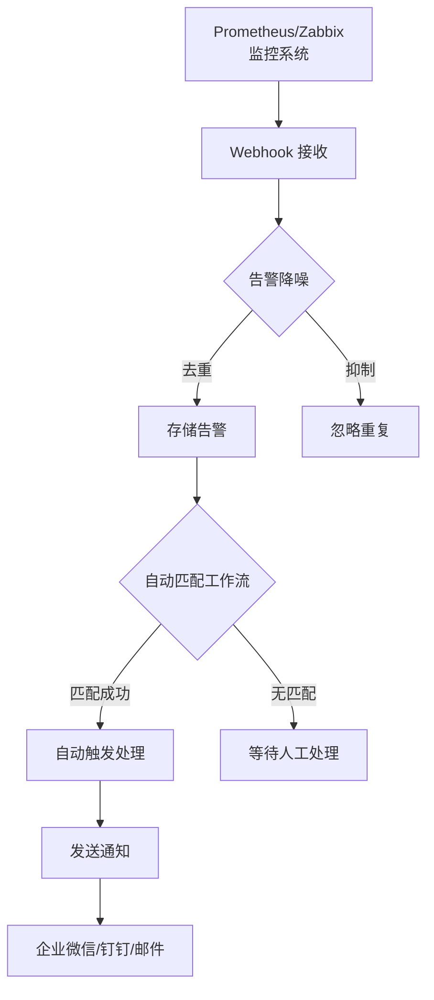

# 第1章 初识 ITOps Agent Platform

## 本章导读

### 本章学习目标

完成本章学习后，你将能够：

- ✅ 说出 ITOps Agent Platform 是什么、能做什么
- ✅ 列举项目的 10+ 核心特性
- ✅ 理解项目的技术栈组成
- ✅ 识别项目的典型应用场景
- ✅ 画出项目的整体架构图

### 前置知识要求

**零基础友好！** 本章不需要任何编程基础，只需：
- 了解什么是网页
- 知道什么是服务器（大概概念即可）
- 会使用电脑和浏览器

### 预计学习时间

30-45 分钟

---

## 1.1 什么是 ITOps Agent Platform？

### 核心概念

想象一下这样的场景：你是一家公司的运维工程师，管理着 **100 台服务器**。每天，这些服务器会产生大量的告警、日志和性能数据。传统的工作方式是这样的：

```
告警来了 → 你手动登录服务器 → 查看日志 → 分析问题 → 执行修复命令 → 写报告
```

这种方式的问题很明显：
- ❌ **效率低**：每个告警都要手动处理，耗时耗力
- ❌ **易出错**：人工操作容易遗漏或误操作
- ❌ **难以扩展**：服务器越多，工作量成倍增长
- ❌ **知识无法沉淀**：老员工的经验无法传承

**ITOps Agent Platform** 就是为了解决这些问题而生的！

> 💡 **通俗理解**：ITOps Agent Platform 就像是一个"智能运维团队"。你不需要自己动手处理每个问题，而是雇佣了一批"AI 运维专家"（Agent），让它们自动帮你完成巡检、诊断、修复等工作。你只需要通过网页界面"指挥"它们就行了！

### 官方定义

**ITOps Agent Platform**（IT 运维多 Agent 自动化平台）是一个企业级全栈运维自动化平台，通过可视化工作流编排多个 AI Agent 协同工作，实现服务器巡检、告警处理、故障诊断、合规检查等运维任务的自动化。

### 关键名词解释

| 名词 | 解释 | 类比 |
|------|------|------|
| **ITOps** | IT Operations，IT 运维 | 公司的"IT 后勤保障部门" |
| **Agent** | 智能体，具有特定能力的 AI 助手 | 运维团队中的"专业工程师" |
| **工作流** | 多个 Agent 按顺序编排的自动化流程 | "工作流程图"，先做什么后做什么 |
| **大语言模型** | 如 GPT、豆包等 AI 模型 | Agent 的"大脑"，让它能理解和推理 |
| **可视化编排** | 通过拖拽方式创建流程 | 像搭积木一样创建运维流程 |

---

## 1.2 核心特性一览

ITOps Agent Platform 拥有以下核心特性，每一项都解决了运维工作中的实际问题：

### 1.2.1 多 Agent 协作

项目内置了 **9 个预设运维 Agent**，每个 Agent 都是一个专业的"运维专家"：

| Agent 名称 | 擅长领域 | 类比 |
|-----------|---------|------|
| 🚨 告警处理 Agent | 分析告警严重程度，提供处理建议 | "告警分析专家" |
| 🔍 故障诊断 Agent | 分析系统故障，定位根因 | "故障侦探" |
| 📋 日志分析 Agent | 分析服务器日志，识别异常 | "日志审查员" |
| 🔎 系统巡检 Agent | 检查服务器健康状态 | "巡检工程师" |
| 🔄 变更执行 Agent | 安全执行系统变更 | "变更操作员" |
| 📝 文档生成 Agent | 生成运维文档和报告 | "文档专员" |
| ✅ 合规检查 Agent | 检查系统合规性 | "合规审计员" |
| 💻 服务器命令执行 Agent | 远程执行服务器命令 | "远程操作员" |
| 🤖 自动巡检 Agent | 定时自动执行巡检 | "自动巡检机器人" |


> 💡 **为什么需要多个 Agent？** 就像现实中的运维团队一样，不同问题需要不同专业的人来处理。告警处理专家擅长分析告警，故障诊断专家擅长找根因。多个 Agent 协作，比一个"万能 Agent"更高效、更准确。

### 1.2.2 可视化工作流编排

这是项目最酷的功能之一！你不需要写代码，只需要在网页上**拖拽节点**就能创建复杂的运维流程。

```
实际操作效果（想象一下）：

┌─────────────────────────────────────────────────────┐
│                    工作流编辑器                        │
│                                                     │
│   ┌──────────┐     ┌──────────┐     ┌──────────┐   │
│   │  告警    │────▶│  故障    │────▶│  修复    │   │
│   │  分析    │     │  诊断    │     │  执行    │   │
│   └──────────┘     └──────────┘     └──────────┘   │
│                                                     │
│   ← 拖拽创建    ← 连线定义顺序    ← 配置每个节点      │
└─────────────────────────────────────────────────────┘
```

**支持的编排方式**：
- 📌 **串行执行**：一个节点完成后再执行下一个
- 🔀 **并行执行**：多个节点同时执行（计划中）
- ⚡ **条件分支**：根据结果选择不同路径（计划中）
- 📡 **实时进度推送**：通过 WebSocket 实时显示执行进度

### 1.2.3 Web SSH 终端

在浏览器里直接操作远程服务器，就像使用本地终端一样！

```
浏览器中的终端效果：

┌─────────────────────────────────────────────────────┐
│ root@server-01:~$                                     │
│                                                       │
│ Last login: Mon May 26 10:00:00 2026                  │
│                                                       │
│ root@server-01:~$ top                                 │
│ Tasks: 150 total,   2 running, 148 sleeping            │
│ %Cpu(s):  5.2 us,  1.3 sy,  0.0 ni, 93.1 id           │
│ KiB Mem : 16384000 total,  8192000 free               │
│ KiB Swap:  4194304 total,  4194304 free               │
│                                                       │
│ root@server-01:~$ █                                   │
│                                                       │
│ ← 实时双向通信  ← 窗口自适应  ← 连接状态可视化          │
└─────────────────────────────────────────────────────┘
```

**技术特点**：
- 基于 [xterm.js](https://xtermjs.org/) 终端模拟器
- 通过 WebSocket 实现实时双向通信
- 窗口大小自动适应
- 支持实时输入输出
- 30 分钟空闲自动断开（安全保护）

### 1.2.4 主机管理增强

管理你的服务器就像整理文件一样简单：

```
服务器分组结构：

📁 所有服务器
 ┣━ 📁 生产环境
 ┃  ┣━ 📁 Web 服务器
 ┃  ┃  ┣━ 🖥️ Web-01 (192.168.1.10)
 ┃  ┃  ┗━ 🖥️ Web-02 (192.168.1.11)
 ┃  ┗━ 📁 数据库服务器
 ┃     ┗━ 🖥️ DB-01 (192.168.1.20)
 ┣━ 📁 测试环境
 ┃  ┗━ 🖥️ Test-01 (192.168.2.10)
 ┗━ 📁 未分组
    ┗━ 🖥️ Unknown-01 (192.168.3.10)
```

**增强功能**：
- 📂 **多级分组**：树形结构，无限层级
- 📥 **CSV 批量导入**：Excel 填好上传即可
- 🔍 **SSH 自动采集**：一键获取 CPU、内存、磁盘、OS 信息
- 🏷️ **标签系统**：灵活标记服务器用途
- 📤 **导出功能**：支持 CSV 和 JSON 格式

### 1.2.5 告警中心

自动接收、处理和分析告警：



**告警处理能力**：
- 🔔 **多渠道接收**：支持 Prometheus、Zabbix、通用 Webhook
- 🔇 **自动降噪**：相同告警自动去重和抑制
- 🔗 **自动触发**：告警到达后自动匹配并触发处理工作流
- 📊 **根因分析**：分析多个告警之间的关联，找出根本原因
- 📬 **多渠道通知**：企业微信、钉钉、邮件、WebSocket 实时推送

### 1.2.6 知识库 + RAG

就像给 AI 运维专家配了一本"运维手册"：

```
RAG（检索增强生成）工作流程：

用户问题："服务器 CPU 使用率过高怎么办？"
         │
         ▼
   ┌─────────────┐
   │  知识库检索  │  ← 22 条预设运维知识
   │             │     + 自定义知识
   └──────┬──────┘
          │ 找到相关知识
          ▼
   ┌─────────────┐
   │  注入上下文  │  ← 将知识一起发给 AI
   └──────┬──────┘
          │
          ▼
   ┌─────────────┐
   │  AI 回答    │  ← 基于知识的准确回答
   └─────────────┘
```

### 1.2.7 AI Copilot

一个会"感知系统状态"的智能运维助手：

```
对话示例：

你: "当前系统有什么告警吗？"

AI Copilot: "当前有 3 个活跃告警：
  1. 🔴 服务器 Web-01 CPU 使用率 95%（严重）
  2. 🟡 服务器 DB-01 磁盘使用率 85%（警告）
  3. 🟢 服务器 Test-01 内存使用恢复正常（已解决）

  建议优先处理 Web-01 的 CPU 问题，要我帮你分析原因吗？"
```

**Copilot 的特点**：
- 🧠 **自动感知**：自动获取系统告警、服务器状态、任务执行情况
- ⚡ **快速响应**：简单问题直接回答，复杂问题调用 LLM 深度分析
- 💬 **对话式交互**：用自然语言对话，不需要记命令

### 1.2.8 多模型支持

支持多种 AI 模型，数据可以完全不出域：

| 模型类型 | 提供商 | 适用场景 |
|---------|--------|---------|
| 国内云 API | 火山引擎 · 豆包 | 国内用户推荐，稳定快速 |
| 国际云 API | OpenAI (GPT-4o) | 有外网环境用户 |
| 本地部署 | Ollama / LM Studio / vLLM | 数据安全要求高，内网部署 |

> 🔒 **数据安全**：所有服务器凭证只在本地加密存储，不会发送给任何第三方 AI。Agent 执行的命令和输出也只在你的服务器内部流转。

### 1.2.9 企业级安全

项目采用了多层安全设计，确保系统和数据安全：

| 安全措施 | 说明 | 类比 |
|---------|------|------|
| 🔐 AES-256-GCM 加密 | 服务器密码和 SSH 密钥加密存储 | "银行级保险箱" |
| 🎫 JWT 双令牌认证 | Access Token + Refresh Token | "门禁卡 + 临时通行证" |
| 📜 完整操作审计 | 所有操作都有记录可追溯 | "全程监控摄像头" |
| 🛡️ 非 root 运行 | 容器以非 root 用户运行 | "普通员工权限，不能乱动" |
| ⚡ API 速率限制 | 防止恶意请求和暴力破解 | "每分钟最多敲 100 次门" |
| 🔑 强制密码修改 | 首次登录强制改默认密码 | "临时密码，第一次必须改" |

### 1.2.10 Docker 一键部署

5 分钟完成部署，新手也能轻松上线：

```bash
# 只需要一条命令
.\deploy.ps1    # Windows
./deploy.sh     # Linux/Mac

# 自动完成：
# ✅ 拉取镜像
# ✅ 生成配置
# ✅ 启动服务
# ✅ 验证健康状态
```

---

## 1.3 技术栈全景

> 📌 **学习提示**：这一节不需要你理解每个技术的具体用法，只需要知道"项目用了什么"。后续章节会逐个详细讲解！

### 前端技术栈

```
┌─────────────────────────────────────────────────────┐
│                    前端技术栈                          │
│                                                     │
│  React 18        ← UI 框架，构建用户界面              │
│  TypeScript      ← 类型系统，让代码更安全              │
│  Vite            ← 构建工具，开发时热更新极快          │
│  Tailwind CSS    ← 样式框架，直接在 HTML 中写样式      │
│  Zustand         ← 状态管理，管理全局数据              │
│  React Query     ← 数据请求缓存，减少重复请求          │
│  @xyflow/react   ← 工作流编辑器，拖拽式编排            │
│  Socket.io       ← 实时通信，WebSocket 封装            │
│  xterm.js        ← 终端模拟器，浏览器中的 SSH 终端     │
└─────────────────────────────────────────────────────┘
```

### 后端技术栈

```
┌─────────────────────────────────────────────────────┐
│                    后端技术栈                          │
│                                                     │
│  Node.js         ← 运行环境，让 JavaScript 跑在服务端  │
│  Express         ← Web 框架，处理 HTTP 请求            │
│  TypeScript      ← 类型系统，让代码更安全              │
│  SQLite          ← 数据库，轻量级嵌入式数据库           │
│  better-sqlite3  ← SQLite 驱动，同步 API 性能更好      │
│  Socket.io       ← 实时通信，WebSocket 服务端          │
│  ssh2            ← SSH 客户端，远程连接服务器           │
│  JWT             ← 认证令牌，用户身份验证               │
│  bcrypt          ← 密码哈希，加密存储密码              │
│  node-schedule   ← 定时任务，按计划自动执行            │
└─────────────────────────────────────────────────────┘
```

### 部署技术栈

```
┌─────────────────────────────────────────────────────┐
│                    部署技术栈                          │
│                                                     │
│  Docker            ← 容器化，打包应用和依赖            │
│  Docker Compose    ← 容器编排，管理多个容器            │
│  Nginx             ← 反向代理，分发请求和静态文件       │
│  GitHub Actions    ← CI/CD，自动化构建和发布           │
└─────────────────────────────────────────────────────┘
```

### 技术栈类比表

| 技术 | 是什么？ | 类比 |
|------|---------|------|
| React | 前端 UI 框架 | "乐高积木"，用组件搭建页面 |
| TypeScript | JavaScript 的超集 | "带检查的作业本"，写错会提醒你 |
| Express | 后端 Web 框架 | "餐厅服务员"，接收请求并处理 |
| SQLite | 轻量级数据库 | "随身笔记本"，不需要独立服务器 |
| Docker | 容器化工具 | "快递包装盒"，把应用和依赖一起打包 |
| Nginx | 反向代理服务器 | "前台接待员"，把请求分发给正确的服务 |

---

## 1.4 项目架构概览

让我们从高空俯瞰整个系统的架构：

```
┌─────────────────────────────────────────────────────────────┐
│                        用户浏览器                             │
│                                                             │
│  ┌──────────┐ ┌──────────┐ ┌──────────┐ ┌──────────┐      │
│  │ 仪表盘   │ │ 服务器   │ │ 工作流   │ │ 告警     │      │
│  │ 页面     │ │ 管理     │ │ 编辑器   │ │ 中心     │      │
│  └──────────┘ └──────────┘ └──────────┘ └──────────┘      │
│                                                             │
│              前端：React + TypeScript                        │
│              30+ 个页面，Zustand 状态管理                     │
└──────────────────────────────┬──────────────────────────────┘
                               │
                    HTTP 请求 + WebSocket
                               │
┌──────────────────────────────▼──────────────────────────────┐
│                    Nginx 反向代理                             │
│                                                             │
│  访问 /         → 转发到前端静态文件                         │
│  访问 /api/*    → 转发到后端 API                             │
│  访问 /ws/*     → 转发到 WebSocket                           │
└──────────────────────────────┬──────────────────────────────┘
                               │
┌──────────────────────────────▼──────────────────────────────┐
│                   后端应用层 (Express)                        │
│                                                             │
│  ┌────────────────────────────────────────────────────┐    │
│  │              API 路由层 (31 个模块)                   │    │
│  │  auth, servers, agents, workflows, tasks, alerts... │    │
│  ├────────────────────────────────────────────────────┤    │
│  │           业务逻辑服务层 (20+ 个服务)                 │    │
│  │  Agent 服务, 工作流执行, SSH 服务, 告警处理...       │    │
│  ├────────────────────────────────────────────────────┤    │
│  │              数据访问层 (SQLite)                     │    │
│  │              44 张数据表，AES-256 加密                │    │
│  └────────────────────────────────────────────────────┘    │
└──────────┬─────────────────────┬─────────────────────┬──────┘
           │                     │                     │
┌──────────▼──────┐  ┌──────────▼──────┐  ┌───────────▼──────┐
│   LLM API       │  │   SSH 远程      │  │   监控系统       │
│   豆包/OpenAI   │  │   目标服务器    │  │   Prometheus     │
│                 │  │                 │  │   Zabbix         │
└─────────────────┘  └─────────────────┘  └──────────────────┘
```

### 架构层级说明

| 层级 | 职责 | 类比 |
|------|------|------|
| **前端层** | 展示界面，用户交互 | "餐厅门面"，顾客看到和使用的部分 |
| **Nginx 层** | 请求分发，静态文件服务 | "前台接待"，引导顾客到正确位置 |
| **后端层** | 业务逻辑，数据处理 | "后厨"，实际干活的地方 |
| **外部服务** | AI 能力，远程服务器，监控数据 | "供应商"，提供额外能力 |

---

## 1.5 典型应用场景

### 场景一：自动告警处理

```
问题：每天收到上百条服务器告警，人工处理不过来

传统方式：
  告警来了 → 人工查看 → 登录服务器 → 排查问题 → 手动修复 → 写记录
  ⏱️ 耗时：30-60 分钟/条

使用 ITOps Agent Platform：
  告警来了 → 自动接收 → 降噪去重 → 自动匹配工作流 → Agent 处理 → 发送结果
  ⏱️ 耗时：2-5 分钟/条
```

### 场景二：定期系统巡检

```
问题：每周需要对 50 台服务器进行巡检

传统方式：
  人工登录每台服务器 → 执行检查命令 → 记录结果 → 汇总报告
  ⏱️ 耗时：4-8 小时

使用 ITOps Agent Platform：
  设置定时任务 → 自动巡检 → Agent 分析 → 自动生成报告
  ⏱️ 耗时：30 分钟（全自动）
```

### 场景三：故障诊断

```
问题：服务器突然变慢，不知道是什么原因

传统方式：
  查 CPU → 查内存 → 查磁盘 → 查网络 → 查日志 → 凭经验判断
  ⏱️ 耗时：1-2 小时，依赖个人经验

使用 ITOps Agent Platform：
  触发故障诊断工作流 → 多个 Agent 协作分析 → LLM 综合推理 → 给出诊断报告
  ⏱️ 耗时：5-10 分钟，标准化输出
```

### 场景四：合规检查

```
问题：需要定期检查服务器是否符合安全规范

传统方式：
  人工对照检查清单 → 逐台服务器检查 → 记录不合规项 → 整改跟踪
  ⏱️ 耗时：数天

使用 ITOps Agent Platform：
  执行合规检查工作流 → 自动检查 14 项安全指标 → 生成合规报告
  ⏱️ 耗时：自动完成，按需执行
```

---

## 1.6 项目信息

### 基本信息

| 项目 | 信息 |
|------|------|
| 项目名称 | ITOps Agent Platform |
| 当前版本 | 3.0.3 |
| 作者 | 谭策 |
| 许可证 | MPL-2.0（弱 Copyleft 开源） |
| GitHub | https://github.com/qinshihu/itops-agent-platform |
| 项目官网 | https://www.zjzwfw.cloud/ITOpsAgentinfo |

### 项目规模

| 指标 | 数据 |
|------|------|
| 前端页面 | 26+ 个页面 |
| 后端路由 | 31 个模块 |
| 业务服务 | 20+ 个服务 |
| 数据表 | 39 张 |
| 预设 Agent | 9 个 |
| 预设工作流 | 6 个 |
| 预设知识库 | 22 条 |
| 代码行数 | 约 20,000+ 行 |

---

## 本章小结

### 核心知识点回顾

- ✅ **ITOps Agent Platform** 是一个企业级 IT 运维自动化平台，通过 AI Agent 协作实现运维任务自动化
- ✅ 项目拥有 **9 个预设 Agent**，覆盖告警处理、故障诊断、日志分析等运维场景
- ✅ 支持 **可视化工作流编排**，拖拽式创建自动化流程
- ✅ 内置 **Web SSH 终端**，浏览器中直接操作远程服务器
- ✅ 支持 **多种 AI 模型**：豆包、OpenAI、本地部署模型
- ✅ 采用 **多层安全设计**：AES-256 加密、JWT 认证、审计日志等
- ✅ **Docker 一键部署**，5 分钟上线
- ✅ 前端使用 React + TypeScript + Tailwind CSS
- ✅ 后端使用 Express + TypeScript + SQLite
- ✅ 部署使用 Docker + Nginx + GitHub Actions

### 常见误区提醒

| 误区 | 正确理解 |
|------|---------|
| "需要很强的编程基础才能用" | 不需要！使用平台本身不需要编程，拖拽即可创建流程 |
| "必须要用付费的 AI 模型" | 不是！支持本地部署模型（Ollama 等），完全免费 |
| "只能管理少量服务器" | 不！设计目标是管理数百台服务器，支持批量操作 |
| "数据安全没保障" | 多层安全防护，数据本地加密存储，不发送给第三方 |

---

## 本章练习

### 基础练习

1. **名词解释**：用自己的话解释以下概念
   - ITOps
   - Agent（智能体）
   - 工作流
   - RAG（检索增强生成）

2. **特性回忆**：不翻看本章内容，列出你能记住的项目核心特性（至少 5 个）

3. **架构描述**：画出你理解的项目架构图，标注出前端、后端、数据库、外部服务

### 进阶练习

4. **场景分析**：假设你需要管理 200 台服务器，列出 3 个你最想用 ITOps Agent Platform 解决的问题

5. **技术调研**：搜索以下技术，简单了解它们的用途
   - React
   - Express
   - Docker
   - SQLite

### 思考题

6. 为什么项目选择使用 SQLite 而不是 MySQL 或 PostgreSQL？这有什么优缺点？
7. 如果你有新的运维需求，你希望平台增加什么样的 Agent 功能？

---

## 延伸阅读

### 官方资源

- [项目 README](https://github.com/qinshihu/itops-agent-platform)
- [项目官网](https://www.zjzwfw.cloud/ITOpsAgentinfo)
- [技术文档](https://github.com/qinshihu/itops-agent-platform/tree/main/docs)

### 技术学习

- [React 官方教程](https://react.dev/learn)
- [TypeScript 官方教程](https://www.typescriptlang.org/docs/)
- [Docker 入门教程](https://docs.docker.com/get-started/)
- [SQLite 官方文档](https://www.sqlite.org/docs.html)

### 概念理解

- [什么是 AIOps？](https://en.wikipedia.org/wiki/AIOps)
- [什么是 Agent（智能体）？](https://en.wikipedia.org/wiki/Intelligent_agent)
- [什么是 RAG（检索增强生成）？](https://en.wikipedia.org/wiki/Retrieval-augmented_generation)

---

> 📖 **下一章预告**：第2章《环境准备与快速上手》—— 我们将一步步搭建开发环境，把项目运行起来！零基础也不用担心，每个步骤都有详细说明。
